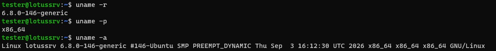
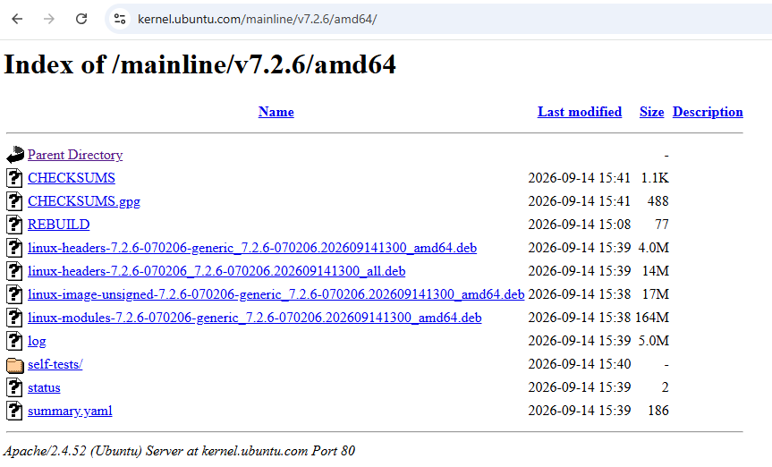
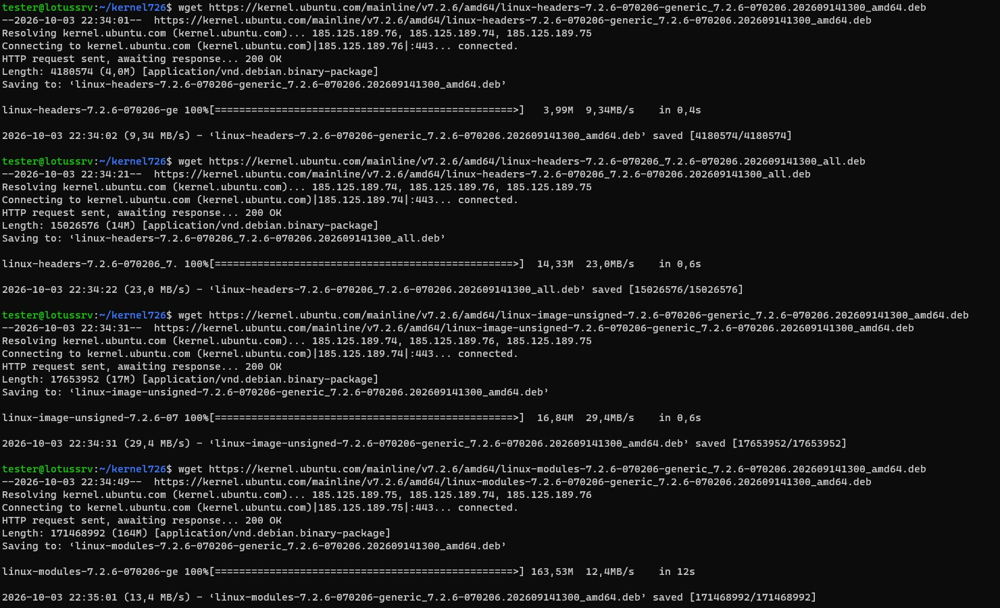
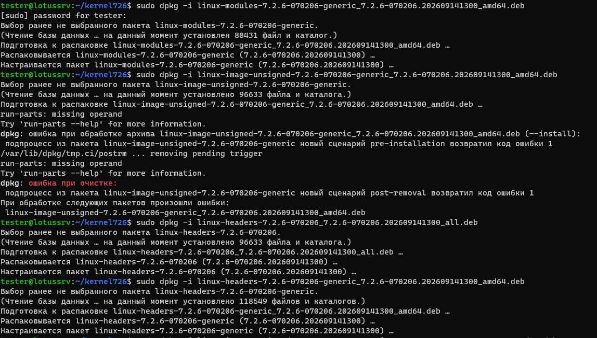
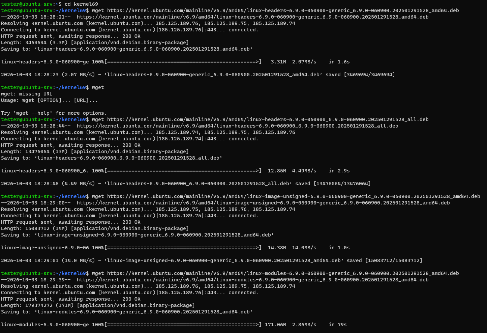
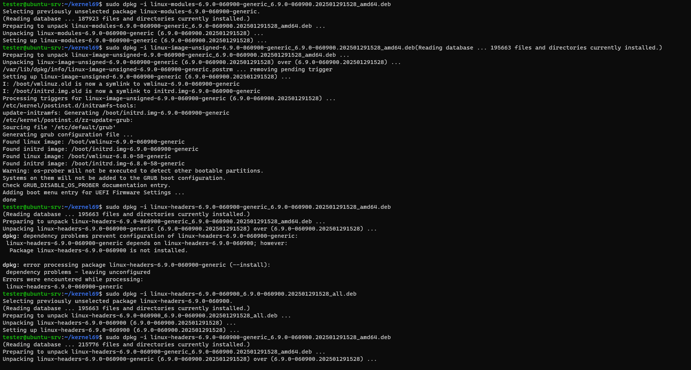
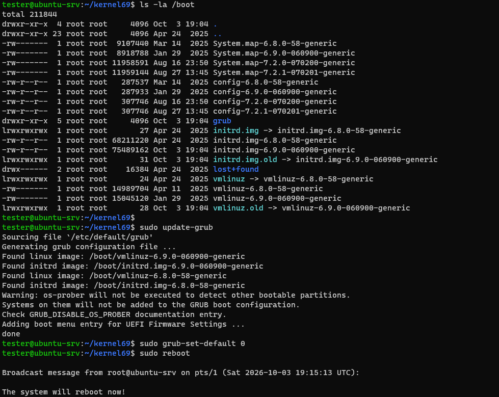
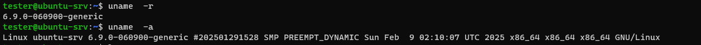

# Администратор Linux. Professional
## Занятие 1. Обновление ядра системы
### Описание домашнего задания
- Запустить ВМ c Ubuntu.
- Обновить ядро ОС на новейшую стабильную версию из mainline-репозитория.
- Оформить отчет в README-файле в GitHub-репозитории.
___

Подключился по SSH к созданной виртуальной машине Ubuntu 24.04 Server

Далее зашел в репозиторий, где найшел свежую версию ядра для нашей архитектуры https://kernel.ubuntu.com/mainline

Качаю актуальные пакеты на виртуальную машину

Устанавливаю пакеты по-очереди. Возникает ошибка 

____________________________________

Однако удалось обновить ядро системы до версии 6.9.0

